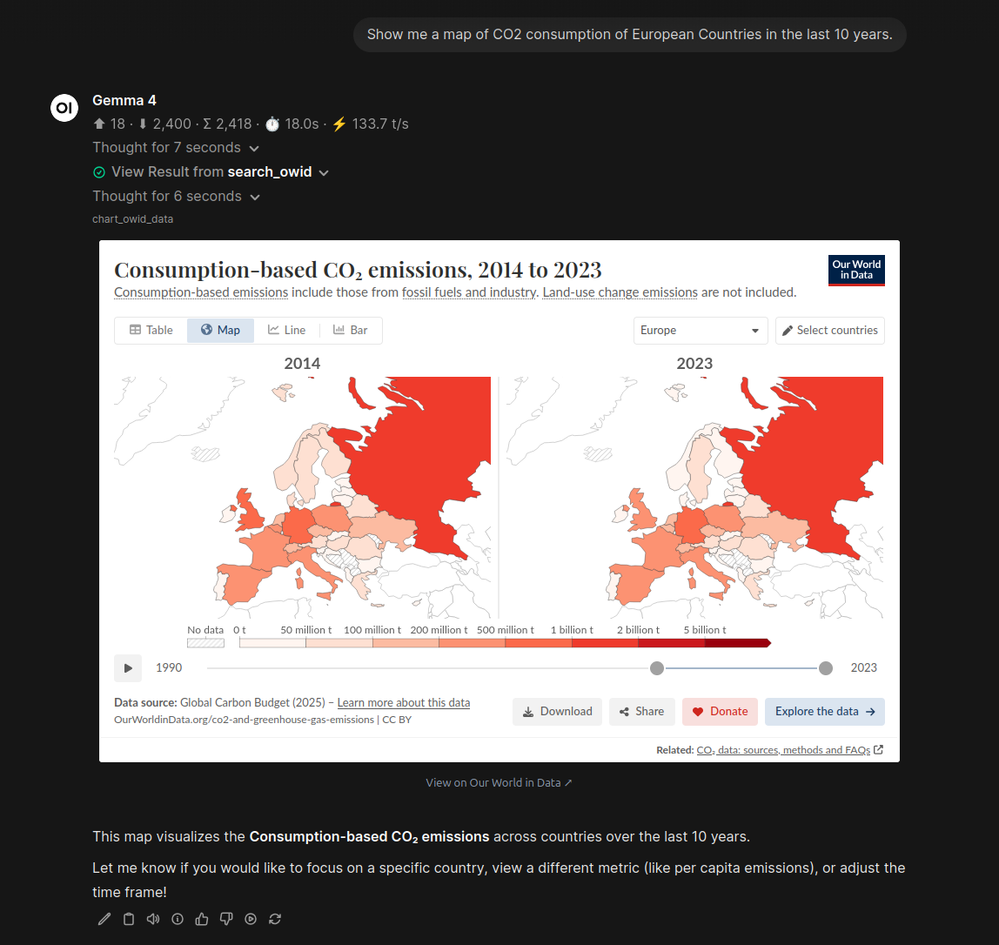
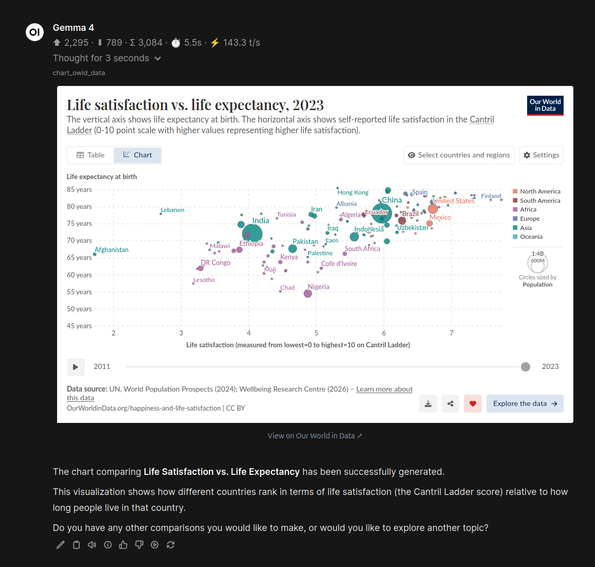
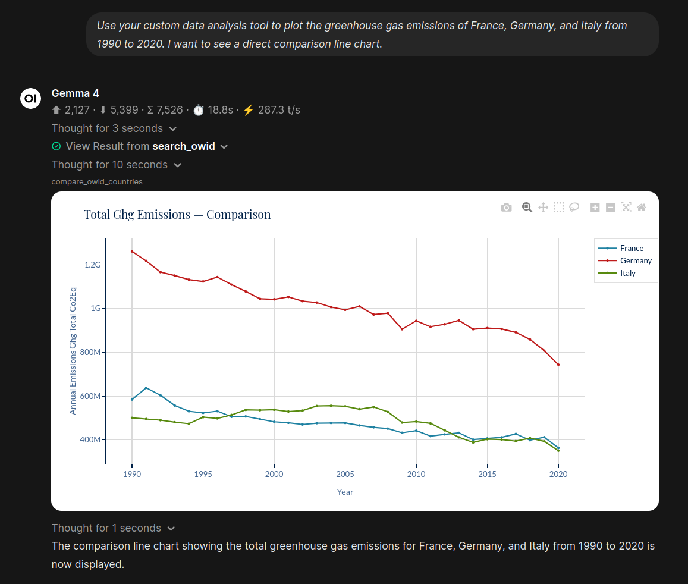
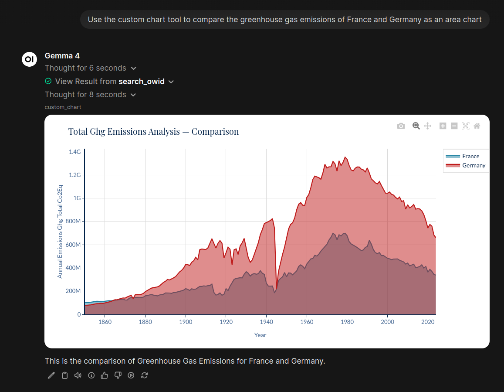

# OWID Data Tools for Open WebUI

An [Open WebUI](https://github.com/open-webui/open-webui) tool plugin **and a remote MCP server** that bring the wealth of data from **[Our World in Data (OWID)](https://ourworldindata.org/)** directly into your LLM chats.

This tool enables your AI assistant to search the OWID catalog, seamlessly embed official interactive charts, and retrieve raw tabular data for deep analysis—all without leaving the chat interface. It works as an Open WebUI tool and as an MCP server you can connect directly from **Gemini** and **Claude**.

## Screenshots

| OWID Official Maps | OWID Official Charts |
| :---: | :---: |
|  |  |
| **Custom Charts** | **More Custom Charts** |
|  |  |

## Features

- **Semantic Catalog Search:** The LLM can quickly search through hundreds of OWID datasets (e.g., life expectancy, CO2 emissions, poverty) and find the exact metrics needed using fuzzy-matching and intelligent caching.
- **Official Interactive Embeds:** Automatically embeds the authentic, fully interactive OWID Grapher directly into the chat interface via responsive iframes. Enjoy maps, multi-country comparisons, and rich tooltips just as they appear on the official website.
- **Raw Data Extraction:** When numerical analysis is required, the tool can extract specific columns, filter by country and year, and return raw data in clean Markdown tables for the LLM to analyze.
- **Dark-Mode Native:** Designed to integrate flawlessly with Open WebUI's aesthetic.


## Installation

1. Open your Open WebUI interface.
2. Navigate to **Workspace** -> **Tools**.
3. Click the **+** button to import a new tool.
4. Copy the entire contents of `owid_tools.py` and paste it into the code editor.
5. Save and enable the tool for your LLM models.

**Prerequisites:** 
Ensure the Python environment running Open WebUI has the following packages installed:
```bash
pip install pandas owid-catalog
```

**Important Note for Pip Installations:**
If you installed Open WebUI via `pip` (rather than Docker), you may need to run `npx inject` in your environment to properly enable frontend features like interactive iframes.

## Using from Gemini & Claude (remote MCP)

The repository also ships `mcp_server.py`, a standalone MCP server that Gemini and Claude can connect to directly from their websites.

### 1. Install & run

```bash
pip install -r requirements.txt
python mcp_server.py
```

By default the server listens on `http://0.0.0.0:8000` and exposes the MCP endpoint at `/mcp`.

### 2. Expose it over HTTPS

Gemini and Claude can only reach your server through a public HTTPS URL. Two easy options:

- **Tailscale Funnel** (no public IP needed):
  ```bash
  tailscale funnel 8000
  ```
  This gives you a public URL such as `https://your-app.tailxxxx.ts.net`.
- Any reverse proxy / cloud host (Fly.io, Render, a VPS with Caddy, Cloudflare Tunnel, …).

### 3. Choose authentication

Set the `MCP_AUTH` environment variable (see `.env.example`):

| Mode | When to use |
| :--- | :--- |
| `none` (default) | Private tunnels (e.g. Tailscale) or local testing |
| `api_key` | Gemini's **API key** auth — set `MCP_API_KEY` and use it as the bearer token |
| `oauth` | **Required by claude.ai** — set `PUBLIC_URL` to your public HTTPS base URL |

### 4. Connect

**Gemini** — In [Google AI Studio](https://aistudio.google.com/) or the Gemini app, go to **Tools → MCP**, choose **Add server**, and enter:

```text
https://<your-public-url>/mcp
```

Then pick the auth mode you configured (`None`, `API key`, or `Google/OAuth`).

**Claude** — In [claude.ai](https://claude.ai), open **Settings → Connect → MCP Servers**, choose **Add remote MCP server**, and enter the same URL. Claude performs OAuth discovery automatically; when prompted, approve the authorization screen.

> For Claude, remember to run with `MCP_AUTH=oauth` and a public `PUBLIC_URL`, otherwise the connection will be rejected.

After connecting, you can ask either assistant to e.g. *"search OWID for life expectancy and chart the United States"* — it will call the exposed tools (`search_owid`, `generate_chart_html`, `get_dataset_schema`, `get_owid_data_json`, …).

## Configuration (Valves)

You can configure the tool's behavior via the Valves settings in Open WebUI:

- `allow_iframe_embedding` (Default: `True`): Allows embedding of the official OWID interactive iframes. If set to `False`, the tool will return direct hyperlinks instead.
- `chart_height_px` (Default: `460`): The default height for embedded charts.
- `max_table_rows` (Default: `20`): Maximum number of rows returned when fetching raw tabular data, protecting the LLM's context window.
- `max_search_results` (Default: `5`): Limits the number of search results returned per query to balance relevance and token usage.

## Disclaimer & Data Ownership

**This project is not affiliated with, endorsed by, or sponsored by Our World in Data.**

This tool is simply an open-source wrapper designed to facilitate access to public data. 

All data, charts, and associated metadata retrieved by this tool are the property of **[Our World in Data](https://ourworldindata.org/)** and their respective authors and data providers. OWID publishes their research and data as open access under the Creative Commons BY license (CC BY 4.0), though specific underlying datasets may have different licenses. 

Please refer to the [OWID Terms of Use](https://ourworldindata.org/how-to-use-our-world-in-data) and ensure you properly cite the original sources when utilizing this data in your own projects or publications.

## License

The wrapper code in this repository is open-sourced under the MIT License. See the [LICENSE](LICENSE) file for details.